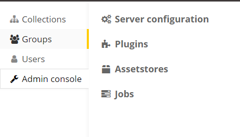
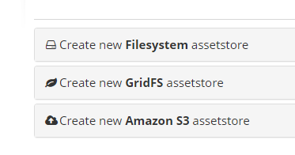
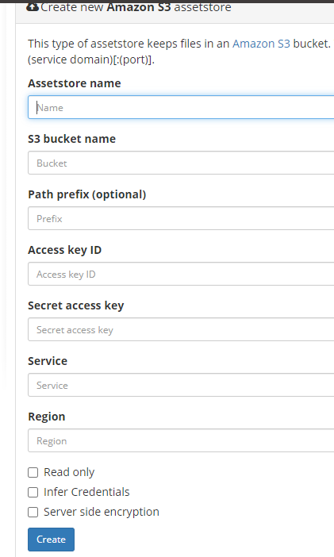

## Adding an S3 Assetstore

DSA allows the user to use/mount multiple types of files systems, including local storage, NFS mounted filesystems
(which requires some minor modifications of the DSA startup script if using DOCKER based installation ).

## Adding an S3 file system

Admin Console -->  Assestore

Then...

Add S3 assestore...

