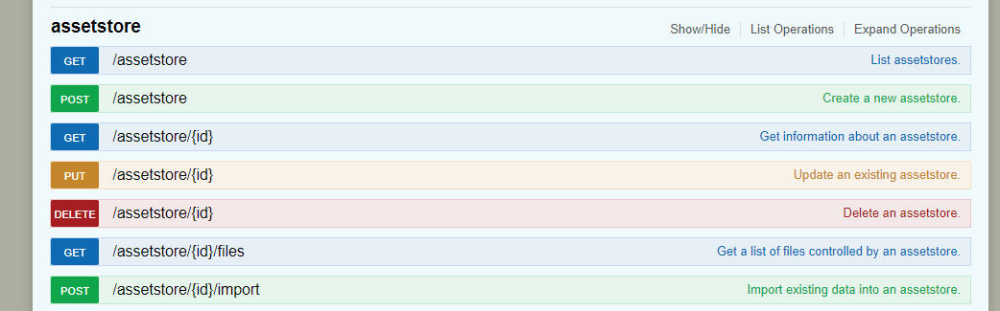
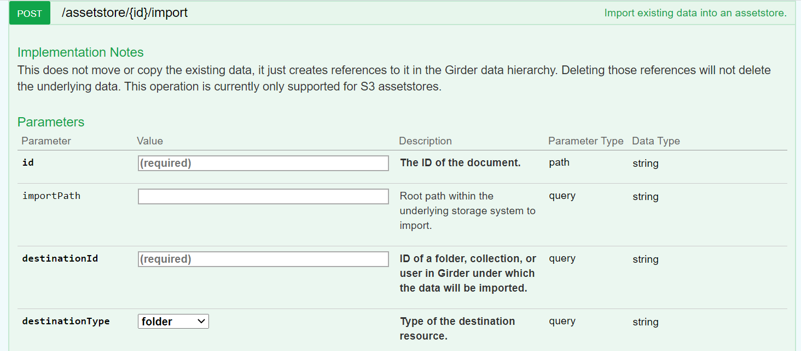

# Initial highlevel steps of DSA indexing data for HTAN Data

Assumptions:  Trigger is fired to internal DSA instance (e.g. from AWS Lambda or equivalent)-- new item has been uploaded to Synapse for the HTAN project.

### Step1. DSA Notication via Rest API
Item is identified by either, 1) File Extension  2) metadata property of dsaToIndex: <b>True</b>

Indexing occurs via the assetstore (i.e. filesystem) based endpoints... System needs to know
a) What is the root path or assetStore ID of the item or directory tree to be indexed
b) Where to "put" it in the DSA i.e. the folder

What's posted to the DSA, logic could be DSA or Synapse side 

To make things robust, we create an endpoint where Sage provides

{ SageID: "TBD",
,S3ID: "TBD",
, S3BucketName: "TBD"}

We have a hard coded data dictionary that maps the S3BucketName to the internal DSA assetstoreID, and potentially a hard coded folder or collection to associate with the data import.  
